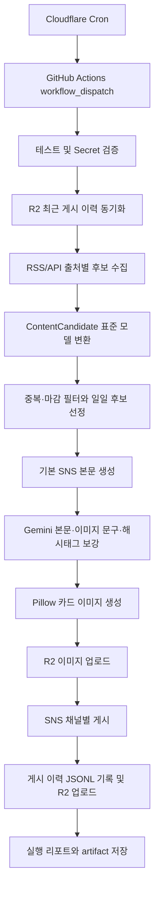

# Public Data Automation

대구 시민에게 필요한 공공정보를 자동으로 수집·분석하고, SNS용 본문과 카드 이미지를
만든 뒤 Facebook, Instagram, Threads, Naver Band에 게시하는 공공정보 자동화
플랫폼입니다.

이 프로젝트는 `2026년 대구광역시 공공데이터·AI 활용 창업경진대회` 제품 및
서비스 개발 부문 참가를 목표로 합니다. 여러 기관과 게시판에 흩어진 정보를
한 번에 수집하고, 시민이 SNS에서 빠르게 이해할 수 있는 형태로 재가공하는 것이
핵심 목적입니다.

## 현재 운영 구조

- Cloudflare Workers Cron이 GitHub Actions `workflow_dispatch`를 호출해 일일
  게시 워크플로를 실행합니다.
- GitHub Actions는 테스트와 필수 Secret 검증을 통과한 뒤 `main.py`를 실행합니다.
- `main.py`는 실행 리포트를 `outputs/YYYY-MM-DD/run_report.txt`에 남기고, 예외가
  발생하면 `outputs/YYYY-MM-DD/failure_report.txt`를 남깁니다.
- 카드 이미지는 `outputs/YYYY-MM-DD/images/post_N.png`로 생성한 뒤 Cloudflare R2
  이미지 버킷에 업로드합니다.
- 게시 이력은 Cloudflare R2의 `private/history/YYYY-MM-DD/history.jsonl`에
  저장하고, 최근 20일 이력을 내려받아 중복 게시를 방지합니다.
- 일부 채널만 실패해도 하나 이상의 채널에 게시되면 이력을 `partial_failed`로
  기록합니다.
- 모든 활성 채널 게시가 실패한 게시물이 있으면 실행을 실패 처리합니다.

## 지원 카테고리와 출처

| 카테고리 | 출처 | 수집 방식 | 주요 모듈 |
| --- | --- | --- | --- |
| 대구 채용·시험 | 대구광역시 시험정보 RSS 5종 | RSS | `sources/daegu_public_recruitment.py` |
| 대구 공모·모집 | 대구시청 공지사항 RSS | RSS 수집 후 키워드 분류 | `sources/daegu_public_opportunities.py` |
| 대구 창업지원 | 창업진흥원 K-Startup 조회서비스 | 공공데이터포털 API | `sources/kstartup_daegu_support.py` |
| 대구 기업지원 | 대구시청 공지사항 RSS | RSS 수집 후 키워드 분류 | `sources/daegu_business_support.py` |

대구시청 공지사항 RSS는 한 번만 수집한 뒤
`sources/daegu_notice_classifier.py`에서 기업지원과 공모·모집으로 분리합니다.
채용, 창업, 입찰, 고시, 공사, 일반 행정성 공지는 중복 또는 오분류를 줄이기 위해
제외합니다.

## 전체 파이프라인



## 후보 선정 정책

구현 위치: `selection/content_selector.py`

- 하루 최대 게시 수는 `4건`입니다.
- 먼저 카테고리별 최신 후보를 1건씩 선택합니다.
- 이미 게시한 `source_url`은 제외합니다.
- 마감일이 오늘보다 이전인 후보는 제외합니다.
- 게시일 또는 등록일을 파싱할 수 있으면 최신순으로 정렬합니다.
- 여러 카테고리가 수집된 날에는 남는 슬롯을 추가 후보로 채웁니다.
- 한 카테고리만 수집된 날에는 같은 카테고리 반복 게시를 막기 위해 추가 보충하지
  않습니다.
- 같은 카테고리는 보충 단계에서 최대 2건까지만 선택합니다.

이 정책 때문에 특정 출처만 정상 수집된 날에는 게시 대상이 1건만 나올 수 있습니다.

## 수집 안정성

구현 위치:

- `pipeline/daily_selection.py`
- `sources/rss_fetcher.py`
- `sources/kstartup_daegu_support.py`

수집기는 출처별 실패를 분리합니다. 특정 RSS 또는 API가 실패해도 다른 출처에서
수집된 후보는 계속 처리합니다.

- RSS는 `requests.get`으로 직접 요청하고 최대 4회 재시도합니다.
- 최종 실패한 RSS는 로그를 남기고 해당 피드만 건너뜁니다.
- K-Startup은 엔드포인트와 페이지 단위로 수집하며, 실패 시 이미 수집된 정상
  항목은 유지합니다.
- 제목 또는 원문 URL이 없는 K-Startup 항목은 후보에서 제외합니다.
- K-Startup 지역 관련성은 제목, 지원 대상, 지원 내용, 주관기관 등 의미 있는
  필드에서 대구 관련 키워드를 찾아 판단합니다.

참고: `.github/workflows/daily-publish.yml`에는 `RSS_PROXY_BASE_URL`,
`RSS_PROXY_TOKEN` 환경변수가 전달되지만, 현재 `sources/rss_fetcher.py`는 이 값을
사용하지 않습니다. 대구시 RSS의 GitHub Actions 접속 타임아웃을 프록시로 우회하려면
RSS fetcher 구현을 추가해야 합니다.

## 콘텐츠 생성

구현 위치:

- `content/post_content_builder.py`
- `content/gemini_content_generator.py`
- `image/card_renderer.py`

기본 본문은 고정 구조로 생성합니다.

```text
📌 [대구 창업지원]
공고 제목

✅ 한눈에 보기
• 요약 문장

🎯 추천 대상
• 추천 대상

📈 수요 예측
• 보수적인 수요 예측 문장

⏰ 마감일: 2026.07.08
🏛️ 출처: 창업진흥원 K-Startup
🔗 원문 보기
https://...

#대구 #창업 #사업 #지원
```

Gemini는 기본 콘텐츠를 다음 항목으로 보강합니다.

- 설명문
- 추천 대상
- 수요 예측
- 카드 이미지 문구
- 게시물별 해시태그 4개

안전장치:

- `GEMINI_API_KEY`가 없거나 API가 실패하면 기본 본문을 그대로 사용합니다.
- 프라이머리 모델이 실패하거나 빈 응답을 주면 폴백 모델로 한 번 더 시도합니다.
- 프라이머리 모델명은 `GEMINI_MODEL`로 바꿀 수 있고, 기본값은 `gemini-3.5-flash`입니다.
- 폴백 모델명은 `GEMINI_FALLBACK_MODEL`로 바꿀 수 있고, 기본값은 `gemini-2.5-flash`입니다.
- 출처, URL, 게시일, 마감일은 Gemini가 만들지 않고 시스템이 붙입니다.
- 원문에 없는 혜택, 조건, 날짜, 지역, 기관명을 추가하지 않도록 프롬프트와
  검증 로직을 둡니다.
- 너무 긴 줄, 위험 확장 키워드가 포함된 줄, 길이 제한을 넘는 이미지 문구는
  제외합니다.
- 해시태그는 `#`, 공백, 특수문자를 제거하고 12자 이하만 사용합니다.
- Gemini 해시태그가 부족하면 카테고리별 기본 해시태그로 4개를 채웁니다.

## 카드 이미지

카드 이미지는 외부 이미지 생성 API가 아니라 Pillow로 생성합니다.

- 기본 크기: `1442x1794`
- 출력 위치: `outputs/YYYY-MM-DD/images/post_N.png`
- 카테고리별 배경색 사용
- 한글 폰트는 macOS의 Apple SD Gothic 또는 GitHub Actions의 Noto CJK를 사용
- 제목과 메타 문구는 카드 폭을 기준으로 자동 줄바꿈
- 공백 없는 긴 문자열은 문자 단위로 나눠 카드 밖으로 넘치지 않게 처리

GitHub Actions에서는 한글 렌더링을 위해 `fonts-noto-cjk`를 설치합니다.

## 게시 채널

구현 위치: `publishing/`

| 채널 | 모듈 | 성공 판단 |
| --- | --- | --- |
| Facebook Page | `publishing/facebook_publisher.py` | `post_id` 또는 `id` 존재 |
| Instagram | `publishing/instagram_publisher.py` | publish 응답의 `id` 존재 |
| Threads | `publishing/threads_publisher.py` | publish 응답의 `id` 존재 |
| Naver Band | `publishing/naver_band_publisher.py` | `result_data.post_key` 존재 |

`publishing/social_publish_pipeline.py`는 `SocialPublisher` 목록을 순회하며 채널별로
게시합니다. 각 채널은 독립적으로 실패 처리되므로 한 채널 실패가 다른 채널 게시를
막지 않습니다.

채널 활성화 환경변수:

```text
ENABLE_FACEBOOK_PUBLISH=true
ENABLE_INSTAGRAM_PUBLISH=true
ENABLE_THREADS_PUBLISH=true
ENABLE_NAVER_BAND_PUBLISH=true
```

환경변수가 없으면 해당 채널은 기본적으로 활성화된 것으로 봅니다. 로컬 점검 중
특정 채널을 끄려면 `false`로 지정합니다.

## 저장소와 중복 방지

Cloudflare R2는 게시 이력과 이미지 자산을 분리해서 사용합니다.

| 용도 | 버킷 환경변수 | 저장 경로 |
| --- | --- | --- |
| 게시 이력 | `R2_BUCKET_NAME` | `private/history/YYYY-MM-DD/history.jsonl` |
| 이미지 자산 | `R2_ASSETS_BUCKET_NAME` | `images/YYYY-MM-DD/post_N.png` |

게시 이력 정책:

- 실행 전 최근 20일 이력을 R2에서 내려받습니다.
- `source_url` 기준으로 중복 게시를 막습니다.
- 하나 이상의 채널이 성공한 게시물만 이력에 남깁니다.
- 모든 활성 채널 성공 시 `published`, 일부 채널만 성공 시 `partial_failed`로
  기록합니다.
- 20일 이상 지난 R2 이력 파일은 정리합니다.

## GitHub Actions

### CI

파일: `.github/workflows/ci.yml`

실행 시점:

- `main` 브랜치 push
- Pull Request

작업:

- Python 3.13 설정
- 한글 폰트 설치
- 의존성 설치
- 전체 단위 테스트 실행

### Daily Public Data Automation

파일: `.github/workflows/daily-publish.yml`

실행 시점:

- Cloudflare Workers Cron이 GitHub REST API로 `workflow_dispatch` 호출
- GitHub Actions UI의 수동 `Run workflow`

작업:

- Python 3.13 설정
- 한글 폰트 설치
- 의존성 설치
- 전체 테스트 실행
- 필수 Secret 확인
- `main.py` 실행
- `outputs/`를 GitHub Actions artifact로 업로드

주의:

- 워크플로의 `TZ`는 `Asia/Seoul`입니다.
- `concurrency` 설정으로 같은 일일 게시 워크플로가 동시에 실행되지 않게 합니다.
- GitHub `schedule` 대신 Cloudflare Cron을 쓰므로 예약 시각은 Cloudflare의 UTC
  기준 cron식에서 관리합니다.

## GitHub Secrets

운영 Secret은 GitHub Repository Secrets에 저장합니다. `.env` 파일은 사용하지
않습니다.

### 공통 Secret

| Secret | 설명 |
| --- | --- |
| `KSTARTUP_API_KEY` | K-Startup 공공데이터포털 API 키 |
| `GEMINI_API_KEY` | Gemini API 키 |
| `R2_ACCOUNT_ID` | Cloudflare R2 Account ID |
| `R2_ACCESS_KEY_ID` | 게시 이력 버킷 접근 키 |
| `R2_SECRET_ACCESS_KEY` | 게시 이력 버킷 Secret |
| `R2_BUCKET_NAME` | 게시 이력 버킷 이름 |
| `R2_ASSETS_ACCESS_KEY_ID` | 이미지 버킷 접근 키 |
| `R2_ASSETS_SECRET_ACCESS_KEY` | 이미지 버킷 Secret |
| `R2_ASSETS_BUCKET_NAME` | 이미지 버킷 이름 |
| `R2_ASSETS_PUBLIC_BASE_URL` | 이미지 공개 URL Base |

### 게시 채널 Secret

| Secret | 설명 |
| --- | --- |
| `FACEBOOK_PAGE_ID` | Facebook Page ID |
| `FACEBOOK_PAGE_ACCESS_TOKEN` | Facebook Page 게시 토큰 |
| `IG_USER_ID` | Instagram Professional 계정 ID |
| `META_ACCESS_TOKEN` | Instagram Graph API 게시 토큰 |
| `THREADS_USER_ID` | Threads 사용자 ID |
| `THREADS_ACCESS_TOKEN` | Threads 게시 토큰 |
| `BAND_ACCESS_TOKEN` | Naver Band Access Token |
| `BAND_KEY` | 게시 대상 Naver Band Key |

### 선택 환경변수

| 이름 | 설명 |
| --- | --- |
| `GEMINI_MODEL` | 프라이머리 Gemini 모델명. 미설정 시 `gemini-3.5-flash` |
| `GEMINI_FALLBACK_MODEL` | 폴백 Gemini 모델명. 미설정 시 `gemini-2.5-flash` |
| `ENABLE_FACEBOOK_PUBLISH` | `false`면 Facebook 게시 비활성화 |
| `ENABLE_INSTAGRAM_PUBLISH` | `false`면 Instagram 게시 비활성화 |
| `ENABLE_THREADS_PUBLISH` | `false`면 Threads 게시 비활성화 |
| `ENABLE_NAVER_BAND_PUBLISH` | `false`면 Naver Band 게시 비활성화 |
| `RSS_PROXY_BASE_URL` | 워크플로에 전달되지만 현재 fetcher에서는 사용하지 않음 |
| `RSS_PROXY_TOKEN` | 워크플로에 전달되지만 현재 fetcher에서는 사용하지 않음 |

## 로컬 개발

### 1. 의존성 설치

```bash
cd /Users/hojun/Documents/public-data-automation
python3 -m pip install --upgrade pip
python3 -m pip install -r requirements.txt
```

### 2. 테스트 실행

```bash
python3 -m unittest discover -s tests
```

### 3. 필수 Secret 확인

```bash
python3 -m scripts.check_required_secrets
```

특정 채널을 임시로 끄고 확인할 수 있습니다.

```bash
ENABLE_NAVER_BAND_PUBLISH=false python3 -m scripts.check_required_secrets
```

### 4. 수집과 후보 확인

```bash
python3 -m scripts.check_daily_selection
python3 -m scripts.check_daegu_public_recruitment
python3 -m scripts.check_daegu_notice_rss
python3 -m scripts.check_daegu_notice_classifier
python3 -m scripts.check_kstartup_daegu_support
```

### 5. 콘텐츠와 이미지 확인

R2 업로드 없이 로컬 이미지 생성까지만 확인합니다.

```bash
python3 -m scripts.check_daily_post_preparation --skip-upload
```

Gemini 보강 결과만 확인합니다.

```bash
python3 -m scripts.check_gemini_content_generator
```

### 6. 실제 게시 실행

주의: 아래 명령은 활성화된 채널에 실제 게시합니다.

```bash
python3 -m scripts.run_daily_publish
```

GitHub Actions와 같은 진입점으로 실행 리포트까지 남기려면 아래 명령을 사용합니다.

```bash
python3 main.py
```

## 주요 디렉터리

```text
sources/      RSS/API 원천 수집과 원천별 정규화
selection/    게시 후보 표준 모델, 어댑터, 일일 선정 정책
content/      SNS 본문, Gemini 보강, 날짜와 해시태그 처리
image/        Pillow 카드 이미지 생성
storage/      Cloudflare R2 이미지와 게시 이력 저장
publishing/   Facebook, Instagram, Threads, Naver Band 게시 모듈
pipeline/     수집 -> 선정 -> 콘텐츠 -> 이미지 -> 게시 흐름
reporting/    실행 리포트와 실패 리포트 생성
scripts/      수동 점검과 운영 실행 스크립트
tests/        단위 테스트
.github/      CI와 일일 게시 GitHub Actions
```

## 테스트 범위

현재 단위 테스트는 다음 영역을 보호합니다.

- RSS/API 수집 실패 복원력
- K-Startup 정규화와 대구 관련성 필터
- 대구 공지사항 키워드 분류
- 게시 후보 선정과 중복/마감 필터
- 본문 생성, 날짜 포맷, Gemini 응답 검증
- 카드 이미지 줄바꿈과 렌더링
- R2 이미지/게시 이력 처리
- 채널별 게시 성공/실패 판단
- 일일 게시 결과, 콘솔 출력, 실행 리포트

## 설계 원칙

- 수집, 선정, 콘텐츠 생성, 이미지 생성, 저장, 게시, 리포팅을 분리합니다.
- 새 공공데이터 출처는 `sources/`와 `selection/content_candidate_adapters.py`에
  격리해서 추가합니다.
- 새 게시 채널은 `publishing/`에 독립 모듈을 만들고 `SocialPublisher`에 등록합니다.
- Secret은 환경변수 또는 GitHub Secrets로만 주입합니다.
- 외부 네트워크/API 실패는 가능한 한 해당 출처 또는 채널에만 국한합니다.
- 운영 정책은 코드 상수와 테스트로 드러나게 유지합니다.

## 운영상 주의사항

- 대구시 RSS는 GitHub Actions 환경에서 `ConnectTimeout`이 발생할 수 있습니다.
  현재 코드는 직접 요청만 수행하므로, 안정적인 해외 러너 운영에는 프록시 또는
  국내 실행 환경 보강이 필요합니다.
- Instagram 게시물 본문 URL은 플랫폼 정책상 일반 웹 링크처럼 클릭되지 않을 수
  있습니다.
- Threads와 Naver Band 토큰은 만료 또는 재승인이 필요할 수 있으므로 주기적으로
  유효성을 확인해야 합니다.
- 게시 이력을 수동으로 삭제하면 같은 원문 URL이 다시 게시될 수 있습니다.
- `scripts.run_daily_publish`는 실제 게시하지만 실행 리포트를 저장하지 않습니다.
  운영과 동일한 리포트가 필요하면 `main.py`를 사용합니다.
