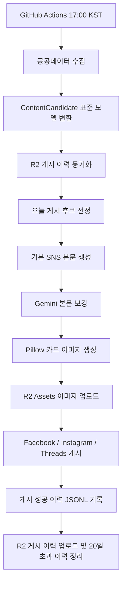

# Public Data Automation

대구 시민에게 필요한 공공정보를 자동으로 수집하고, 읽기 쉬운 SNS 콘텐츠로
가공한 뒤 Facebook, Instagram, Threads, Naver Band에 게시하기 위한 자동화
플랫폼입니다.

이 프로젝트는 `2026년 대구광역시 공공데이터·AI 활용 창업경진대회` 제품 및
서비스 개발 부문 참가를 목표로 합니다. 핵심 문제의식은 공공정보가 흩어져 있고
연령대·플랫폼별 이용 습관이 달라 필요한 정보가 시민에게 제때 전달되지 않는다는
점입니다.

## 핵심 목표

- 대구 시민에게 필요한 공공정보를 매일 자동 수집합니다.
- 최신 공고를 우선 선정하되, 이미 게시한 공고와 마감된 공고는 제외합니다.
- AI를 활용해 공고 제목과 요약을 시민 친화적인 SNS 본문으로 변환합니다.
- 카드형 이미지를 자동 생성하고 Cloudflare R2에 업로드합니다.
- Facebook, Instagram, Threads에 자동 게시합니다.
- Naver Band는 API 승인 후 바로 활성화할 수 있도록 모듈과 설정을 준비해 둡니다.
- GitHub Actions로 매일 17:00 KST에 자동 실행합니다.

## 현재 지원 카테고리

| 카테고리 | 데이터 출처 | 수집 방식 |
| --- | --- | --- |
| 대구 채용·시험 | 대구광역시 채용·시험 RSS 5종 | RSS |
| 대구 공모·모집 | 대구광역시 공지사항 RSS | RSS 수집 후 분류 |
| 대구 창업지원 | 창업진흥원 K-Startup 조회서비스 | 공공데이터포털 API |
| 대구 기업지원 | 대구광역시 공지사항 RSS | RSS 수집 후 분류 |

### 대구 채용·시험 RSS

- 공채/경채 공무원
- 임기제/별정직 공무원
- 청원경찰
- 개방형직위
- 중앙 및 타기관 채용소식

### 대구 공모·모집 / 대구 기업지원

대구시청 공지사항 RSS는 범위가 넓기 때문에 한 번만 수집한 뒤
`sources/daegu_notice_classifier.py`에서 카테고리별 키워드 정책으로 분리합니다.

분류 원칙:

- 채용·시험 키워드는 공지사항 분류에서 제외합니다.
- 창업 키워드는 K-Startup 카테고리와 겹치지 않도록 제외합니다.
- 기업지원과 공모·모집이 동시에 잡히지 않도록 제외 키워드를 우선 적용합니다.
- 입찰, 용역, 공사, 고시 등 일반 행정 공지는 제외합니다.

## 전체 파이프라인



## 게시 후보 선정 정책

구현 위치: `selection/content_selector.py`

- 하루 최대 게시 수: `4개`
- 카테고리별 기본 게시 수: `1개`
- 이미 게시한 원문 URL은 제외
- 마감일이 지난 공고는 제외
- 게시일 또는 등록일 기준 최신순 정렬
- 여러 카테고리가 있을 때 부족한 게시 수는 다른 후보로 보충
- 단, 한 카테고리 데이터만 수집된 날에는 같은 카테고리를 과도하게 반복 게시하지 않도록 보충하지 않음

이 정책은 계정의 최신성을 유지하면서도 특정 카테고리로 피드가 도배되는 것을
막기 위한 운영 정책입니다.

## 콘텐츠 생성 정책

구현 위치:

- `content/post_content_builder.py`
- `content/gemini_content_generator.py`
- `image/card_renderer.py`

### 본문 형식

게시 본문은 사람이 빠르게 읽을 수 있도록 고정된 구조를 사용합니다.

```text
📌 [대구 창업지원]
2026년도 딥테크 특화 창업중심대학 창업기업 모집공고
✅ 핵심 내용
- 과학기술원 기반 신산업 분야 유망 창업 기업을 지원하는 사업입니다.
⏰ 마감일: 2026.07.08
🏛️ 출처: 창업진흥원 K-Startup
🔗 자세히 보기
https://www.k-startup.go.kr/...
#대구 #창업 #사업 #지원
```

### 카테고리별 고정 해시태그

Gemini가 어떤 해시태그를 생성하더라도 최종 게시물에는 아래 4개 해시태그를
고정 적용합니다.

| 카테고리 | 해시태그 |
| --- | --- |
| 대구 채용·시험 | `#대구 #취업 #취준 #시험` |
| 대구 공모·모집 | `#대구 #공모전 #모집 #정보` |
| 대구 창업지원 | `#대구 #창업 #사업 #지원` |
| 대구 기업지원 | `#대구 #기업 #사업 #지원` |

### AI 사용 방식

Gemini는 제목과 요약을 기반으로 본문 설명문과 이미지 문구를 보강합니다.

안전장치:

- 출처, 링크, 해시태그는 Gemini가 만들지 않고 시스템이 붙입니다.
- 원문에 없는 혜택, 조건, 날짜, 지역, 기관명은 추가하지 않도록 프롬프트에서 제한합니다.
- 설명문이 너무 길거나 위험 키워드가 포함되면 기본 본문으로 되돌립니다.
- Gemini API가 실패하면 게시를 중단하지 않고 기본 본문을 사용합니다.

## 이미지 생성

카드 이미지는 외부 이미지 생성 API가 아니라 Pillow로 생성합니다.

이유:

- API 비용과 실패 가능성을 줄입니다.
- 공공정보 전달용 이미지는 일관된 텍스트 카드가 더 적합합니다.
- GitHub Actions에서 재현 가능한 결과를 만들 수 있습니다.

GitHub Actions에서는 한글 렌더링을 위해 `fonts-noto-cjk`를 설치합니다.

## 게시 채널

구현 위치: `publishing/`

| 채널 | 모듈 | 현재 상태 |
| --- | --- | --- |
| Facebook Page | `publishing/facebook_publisher.py` | 활성화 |
| Instagram | `publishing/instagram_publisher.py` | 활성화 |
| Threads | `publishing/threads_publisher.py` | 활성화 |
| Naver Band | `publishing/naver_band_publisher.py` | API 승인 후 활성화 |

채널 활성화는 환경변수로 제어합니다.

```text
ENABLE_FACEBOOK_PUBLISH=true
ENABLE_INSTAGRAM_PUBLISH=true
ENABLE_THREADS_PUBLISH=true
ENABLE_NAVER_BAND_PUBLISH=false
```

현재 운영 워크플로우에서는 Naver Band를 `false`로 둡니다. Band API 승인 후
필요한 Secret을 추가하고 `true`로 바꾸면 같은 파이프라인에서 함께 게시됩니다.

## 저장소와 중복 방지

Cloudflare R2를 두 용도로 분리해 사용합니다.

| 용도 | 버킷 | 설명 |
| --- | --- | --- |
| 게시 이력 | `R2_BUCKET_NAME` | 중복 게시 방지용 JSONL 저장 |
| 이미지 자산 | `R2_ASSETS_BUCKET_NAME` | SNS 게시용 카드 이미지 저장 |

게시 이력은 `source_url` 기준으로 중복을 판단합니다.

운영 정책:

- 실행 전 최근 20일 게시 이력을 R2에서 내려받습니다.
- 오늘 성공한 게시 결과를 로컬 `history.jsonl`에 기록합니다.
- 오늘 이력을 R2 `private/history/YYYY-MM-DD/history.jsonl`에 업로드합니다.
- 20일이 지난 R2 게시 이력은 자동 삭제합니다.

## GitHub Actions

### CI

파일: `.github/workflows/ci.yml`

실행 시점:

- `main` 브랜치 push
- Pull Request

작업:

- Python 3.13 설정
- 한글 폰트 설치
- 의존성 설치
- 전체 테스트 실행

### Daily Publish

파일: `.github/workflows/daily-publish.yml`

실행 시점:

- 매일 `17:00 KST`
- 수동 실행 가능: GitHub Actions의 `workflow_dispatch`

주의:

- GitHub cron은 UTC 기준이라 `0 8 * * *`가 17:00 KST입니다.
- 워크플로우 환경변수 `TZ`는 `Asia/Seoul`로 지정되어 있습니다.

작업:

- 테스트 실행
- 필수 Secret 확인
- 오늘 게시 후보 선정
- 이미지 생성 및 R2 업로드
- SNS 게시
- 게시 이력 기록 및 R2 업로드

## GitHub Secrets

운영 Secret은 GitHub Repository Secrets에 저장합니다. `.env` 파일은 사용하지
않습니다.

### 항상 필요한 Secret

| Secret | 설명 |
| --- | --- |
| `KSTARTUP_API_KEY` | K-Startup 공공데이터포털 API 키 |
| `GEMINI_API_KEY` | Gemini API 키 |
| `R2_ACCOUNT_ID` | Cloudflare R2 Account ID |
| `R2_ACCESS_KEY_ID` | 게시 이력 버킷 접근 키 |
| `R2_SECRET_ACCESS_KEY` | 게시 이력 버킷 Secret |
| `R2_BUCKET_NAME` | 게시 이력 버킷 이름 |
| `R2_ASSETS_ACCESS_KEY_ID` | 이미지 버킷 접근 키 |
| `R2_ASSETS_SECRET_ACCESS_KEY` | 이미지 버킷 Secret |
| `R2_ASSETS_BUCKET_NAME` | 이미지 버킷 이름 |
| `R2_ASSETS_PUBLIC_BASE_URL` | 이미지 공개 URL Base |

### 채널별 Secret

Facebook 활성화 시:

```text
FACEBOOK_PAGE_ID
FACEBOOK_PAGE_ACCESS_TOKEN
```

Instagram 활성화 시:

```text
IG_USER_ID
META_ACCESS_TOKEN
```

Threads 활성화 시:

```text
THREADS_USER_ID
THREADS_ACCESS_TOKEN
```

Naver Band 활성화 시:

```text
BAND_ACCESS_TOKEN
BAND_KEY
```

## 로컬 개발

### 1. 저장소 이동

```bash
cd /Users/hojun/Documents/public-data-automation
```

### 2. 의존성 설치

```bash
python3 -m pip install --upgrade pip
python3 -m pip install -r requirements.txt
```

### 3. 테스트 실행

```bash
ENABLE_NAVER_BAND_PUBLISH=false python3 -m unittest discover -s tests
```

### 4. 필수 Secret 확인

GitHub Actions에서는 Repository Secrets가 자동 주입됩니다. 로컬에서 확인하려면
필요한 환경변수를 터미널에 export한 뒤 실행합니다.

```bash
ENABLE_NAVER_BAND_PUBLISH=false python3 -m scripts.check_required_secrets
```

### 5. 게시 후보 확인

실제 API와 RSS를 호출합니다.

```bash
python3 -m scripts.check_daily_selection
```

### 6. 게시 전 콘텐츠/이미지 준비 확인

```bash
python3 -m scripts.check_daily_post_preparation
```

### 7. 실제 게시 실행

주의: 아래 명령은 활성화된 채널에 실제 게시합니다.

```bash
python3 -m scripts.run_daily_publish
```

## 주요 디렉터리 구조

```text
sources/      RSS/API 원천 수집 및 원천별 정규화
selection/    게시 후보 표준 모델과 일일 선정 정책
content/      SNS 본문, 해시태그, Gemini 보강
image/        Pillow 카드 이미지 생성
storage/      Cloudflare R2 이미지/게시 이력 저장
publishing/   Facebook, Instagram, Threads, Naver Band 게시 모듈
pipeline/     수집 → 선정 → 콘텐츠 → 이미지 → 게시 전체 흐름
scripts/      수동 점검 및 운영 실행 스크립트
tests/        단위 테스트
.github/      CI 및 일일 게시 GitHub Actions
```

## 설계 원칙

이 저장소는 장기 운영을 전제로 다음 원칙을 따릅니다.

- 수집, 선정, 콘텐츠 생성, 이미지 생성, 게시, 저장을 분리합니다.
- 새 공공데이터 출처는 `sources/`와 `selection/content_candidate_adapters.py`에
  격리해서 추가합니다.
- 게시 채널은 `publishing/`에 독립 모듈로 추가합니다.
- Secret은 환경변수 또는 GitHub Secrets로만 주입합니다.
- 네트워크/API 실패가 전체 파이프라인을 불필요하게 중단하지 않도록 fallback을 둡니다.
- 분류, 선정, 게시 실패 처리, R2 이력 처리는 테스트로 보호합니다.

## 현재 운영상 주의사항

- Instagram 게시물 본문 링크는 플랫폼 정책상 일반 웹 링크처럼 클릭되지 않을 수
  있습니다. Facebook과 Threads는 본문 URL이 링크로 노출될 수 있지만, Instagram은
  프로필 링크 또는 QR 코드 같은 보조 방식이 필요할 수 있습니다.
- Threads 장기 토큰은 만료일이 있으므로 만료 전에 갱신해야 합니다.
- Naver Band는 API 승인 후 `BAND_ACCESS_TOKEN`, `BAND_KEY`를 추가하고
  `ENABLE_NAVER_BAND_PUBLISH`를 `true`로 바꿔야 실제 게시됩니다.
- GitHub Actions에서 실제 게시가 성공하면 R2 게시 이력에 기록되므로 같은 원문 URL은
  이후 중복 게시되지 않습니다.
