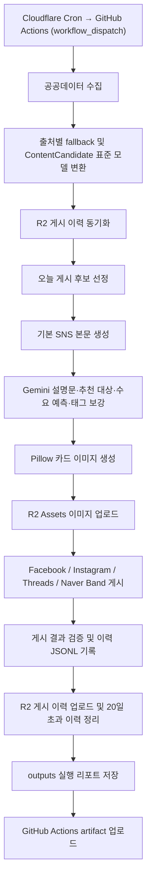

# Public Data Automation

대구 시민에게 필요한 공공정보를 자동으로 수집하고, SNS별로 읽기 쉬운
콘텐츠와 카드 이미지를 만든 뒤 Facebook, Instagram, Threads, Naver Band에
게시하는 운영 자동화 플랫폼입니다.

이 프로젝트는 `2026년 대구광역시 공공데이터·AI 활용 창업경진대회` 제품 및
서비스 개발 부문 참가를 목표로 합니다. 핵심 문제의식은 공공정보가 여러
사이트에 흩어져 있고, 연령대와 플랫폼별 이용 습관이 달라 필요한 정보가
시민에게 제때 전달되지 않는다는 점입니다.

## 운영 상태

- 외부 스케줄러(Cloudflare Workers Cron)가 매일 지정한 시각에 GitHub Actions를
  `workflow_dispatch`로 트리거해 자동 실행합니다.
- Facebook Page, Instagram, Threads, Naver Band 게시가 활성화되어 있습니다.
- 실행 결과는 GitHub Actions 로그와 `outputs/` artifact의 `run_report.txt`,
  `failure_report.txt`에서 확인합니다.
- 이미 게시한 원문 URL은 Cloudflare R2 게시 이력으로 중복 게시를 방지합니다.
- 마감된 공고는 게시 후보에서 제외합니다.
- Gemini API 장애가 발생해도 기본 게시 문구와 기본 해시태그로 fallback합니다.

## 지원 카테고리

| 카테고리 | 데이터 출처 | 수집 방식 |
| --- | --- | --- |
| 대구 채용·시험 | 대구광역시 채용·시험 RSS 5종 | RSS |
| 대구 공모·모집 | 대구광역시 공지사항 RSS | RSS 수집 후 분류 |
| 대구 창업지원 | 창업진흥원 K-Startup 조회서비스 | 공공데이터포털 API |
| 대구 기업지원 | 대구광역시 공지사항 RSS | RSS 수집 후 분류 |

### 대구 채용·시험 RSS

- 공채/경채 공무원
- 임기제/별정직 공무원
- 청원경찰
- 개방형직위
- 중앙 및 타기관 채용소식

### 대구 공모·모집 / 대구 기업지원

대구시청 공지사항 RSS는 범위가 넓기 때문에 한 번만 수집한 뒤
`sources/daegu_notice_classifier.py`에서 카테고리별 키워드 정책으로 분리합니다.

분류 원칙:

- 채용·시험 키워드는 공지사항 분류에서 제외합니다.
- 창업 키워드는 K-Startup 카테고리와 겹치지 않도록 제외합니다.
- 기업지원과 공모·모집이 동시에 잡히지 않도록 제외 키워드를 우선 적용합니다.
- 입찰, 용역, 공사, 고시 등 일반 행정 공지는 제외합니다.

## 전체 파이프라인



## 수집 안정성 정책

구현 위치:

- `pipeline/daily_selection.py`
- `sources/kstartup_daegu_support.py`
- `sources/rss_fetcher.py`

수집 단계는 출처별로 독립 실행됩니다. 특정 RSS나 API가 일시적으로 실패해도
다른 출처의 데이터 수집과 게시 후보 선정은 계속 진행됩니다.

운영 정책:

- RSS/API 요청 실패는 해당 출처만 건너뛰고 로그를 남깁니다.
- K-Startup은 페이지 단위로 수집하며, 일부 페이지 요청이 실패해도 이미 수집한
  정상 데이터는 유지합니다.
- 제목 또는 원문 링크가 비어 있는 K-Startup 항목은 게시 후보에서 제외합니다.
- 외부 요청 장애와 코드 버그를 구분하기 위해 수집 fallback은 네트워크 요청 예외
  중심으로 처리합니다.

## 게시 후보 선정 정책

구현 위치: `selection/content_selector.py`

- 하루 최대 게시 수: `4개`
- 카테고리별 기본 게시 수: `1개`
- 이미 게시한 원문 URL 제외
- 마감일이 지난 공고 제외
- 게시일 또는 등록일 기준 최신순 정렬
- 여러 카테고리가 있을 때 부족한 게시 수는 다른 후보로 보충
- 단, 한 카테고리 데이터만 수집된 날에는 같은 카테고리를 과도하게 반복 게시하지
  않도록 보충하지 않음

이 정책은 계정의 최신성을 유지하면서도 특정 카테고리로 피드가 도배되는 것을
막기 위한 운영 정책입니다.

## 콘텐츠 생성 정책

구현 위치:

- `content/post_content_builder.py`
- `content/gemini_content_generator.py`
- `image/card_renderer.py`

### 본문 형식

게시 본문은 사람이 빠르게 읽을 수 있도록 고정된 구조를 사용합니다.

```text
📌 [대구 창업지원]
2026년도 딥테크 특화 창업중심대학 창업기업 모집공고

✅ 한눈에 보기
• 과학기술원 기반 신산업 분야 유망 창업 기업을 지원하는 사업입니다.
• 딥테크 분야 창업에 관심 있는 기업은 참여해 보시기 바랍니다.

🎯 추천 대상
• 대구 창업지원 공고를 찾는 예비창업자
• 딥테크 분야 창업을 준비하는 기업

📈 수요 예측
• 마감일이 있어 관련 창업기업의 확인 수요가 있을 수 있습니다.

🗓️ 마감일: 2026.07.08
🏛️ 출처: 창업진흥원 K-Startup
🔗 원문 보기
https://www.k-startup.go.kr/...

#대구 #창업지원 #딥테크 #사업공고
```

### AI 기반 동적 해시태그

Gemini가 게시물 제목, 요약, 카테고리를 기준으로 게시물별 해시태그를 생성합니다.
운영 안정성을 위해 생성된 태그를 그대로 쓰지 않고 다음과 같이 정제·보충해 항상
4개를 채웁니다.

- 각 태그에서 `#`과 공백, 특수문자를 제거하고 12자를 넘는 태그는 버립니다.
- 유효한 AI 태그를 우선 채택하고 중복은 제거합니다.
- 4개가 되지 않으면 부족한 만큼 아래 카테고리별 기본 태그로 보충합니다.
- 유효한 AI 태그가 하나도 없거나 Gemini API가 실패하면 카테고리별 기본 태그를
  사용합니다.

| 카테고리 | 해시태그 |
| --- | --- |
| 대구 채용·시험 | `#대구 #취업 #취준 #시험` |
| 대구 공모·모집 | `#대구 #공모전 #모집 #정보` |
| 대구 창업지원 | `#대구 #창업 #사업 #지원` |
| 대구 기업지원 | `#대구 #기업 #사업 #지원` |

### AI 사용 방식

Gemini는 제목과 요약을 기반으로 본문 설명문, 추천 대상, 수요 예측, 이미지 문구,
게시물별 해시태그 4개를 보강합니다.

안전장치:

- 출처, 링크, 날짜는 Gemini가 만들지 않고 시스템이 붙입니다.
- AI가 만든 해시태그는 검증을 통과한 경우에만 사용합니다.
- 원문에 없는 혜택, 조건, 날짜, 지역, 기관명은 추가하지 않도록 제한합니다.
- 설명문, 추천 대상, 수요 예측은 너무 길거나 위험 키워드가 포함된 줄만 제외하고
  유효한 줄은 사용하며, 설명문이 모두 제외되면 기본 요약으로 대체합니다.
- Gemini API가 실패하면 게시를 중단하지 않고 기본 본문을 사용합니다.

## 이미지 생성

카드 이미지는 외부 이미지 생성 API가 아니라 Pillow로 생성합니다.

이유:

- API 비용과 실패 가능성을 줄입니다.
- 공공정보 전달용 이미지는 일관된 텍스트 카드가 더 적합합니다.
- GitHub Actions에서 재현 가능한 결과를 만들 수 있습니다.

GitHub Actions에서는 한글 렌더링을 위해 `fonts-noto-cjk`를 설치합니다.

이미지 문구가 카드 밖으로 넘치지 않도록 줄 단위 폭을 계산해 자동 줄바꿈합니다.
공백 없는 긴 문구나 괄호가 긴 제목도 카드 폭을 초과하면 문자 단위로 나눠
렌더링합니다.

## 게시 채널

구현 위치: `publishing/`

| 채널 | 모듈 | 현재 상태 |
| --- | --- | --- |
| Facebook Page | `publishing/facebook_publisher.py` | 활성화 |
| Instagram | `publishing/instagram_publisher.py` | 활성화 |
| Threads | `publishing/threads_publisher.py` | 활성화 |
| Naver Band | `publishing/naver_band_publisher.py` | 활성화 |

게시 채널은 `publishing/social_publish_pipeline.py`의 `SocialPublisher` 구조로
등록합니다.

각 Publisher는 다음 정보를 명시적으로 가집니다.

- 채널 이름
- 실제 게시 함수
- 활성화 여부를 결정하는 환경변수 이름

따라서 함수명에 의존해 채널을 추론하지 않고, 새 채널을 추가할 때도 명시적인
Publisher만 추가하면 됩니다.

채널 활성화는 환경변수로 제어합니다.

```text
ENABLE_FACEBOOK_PUBLISH=true
ENABLE_INSTAGRAM_PUBLISH=true
ENABLE_THREADS_PUBLISH=true
ENABLE_NAVER_BAND_PUBLISH=true
```

게시 성공 검증:

- Facebook은 최종 응답의 `post_id` 또는 `id`가 있어야 성공으로 처리합니다.
- Instagram은 최종 publish 응답의 `id`가 있어야 성공으로 처리합니다.
- Threads는 최종 publish 응답의 `id`가 있어야 성공으로 처리합니다.
- Naver Band는 최종 응답의 `post_key`가 있어야 성공으로 처리합니다.
- 게시 ID가 없으면 API 호출이 끝났더라도 실패로 기록합니다.
- 일부 채널만 성공한 경우 게시 이력은 `partial_failed` 상태로 기록합니다.

## 저장소와 중복 방지

Cloudflare R2를 두 용도로 분리해 사용합니다.

| 용도 | 버킷 | 설명 |
| --- | --- | --- |
| 게시 이력 | `R2_BUCKET_NAME` | 중복 게시 방지용 JSONL 저장 |
| 이미지 자산 | `R2_ASSETS_BUCKET_NAME` | SNS 게시용 카드 이미지 저장 |

게시 이력은 `source_url` 기준으로 중복을 판단합니다.

운영 정책:

- 실행 전 최근 20일 게시 이력을 R2에서 내려받습니다.
- 오늘 성공한 게시 결과를 로컬 `history.jsonl`에 기록합니다.
- 오늘 이력을 R2 `private/history/YYYY-MM-DD/history.jsonl`에 업로드합니다.
- 20일이 지난 R2 게시 이력은 자동 삭제합니다.
- 하나 이상의 채널이 성공하면 이력을 남깁니다.
- 모든 활성화 채널이 성공하면 `published`, 일부 채널만 성공하면
  `partial_failed`로 기록합니다.

## GitHub Actions

### CI

파일: `.github/workflows/ci.yml`

실행 시점:

- `main` 브랜치 push
- Pull Request

작업:

- Python 3.13 설정
- 한글 폰트 설치
- 의존성 설치
- 전체 테스트 실행

### Daily Public Data Automation

파일: `.github/workflows/daily-publish.yml`

실행 시점:

- 외부 스케줄러(Cloudflare Workers Cron)가 매일 지정한 시각에 GitHub REST API로
  `workflow_dispatch`를 호출해 실행합니다.
- 수동 실행도 가능합니다: GitHub Actions의 `Run workflow`(`workflow_dispatch`).

작업:

- 테스트 실행
- 필수 Secret 확인
- `main.py` 단일 진입점으로 오늘 게시 후보 선정
- 이미지 생성 및 R2 업로드
- Facebook / Instagram / Threads / Naver Band 게시
- 게시 이력 기록 및 R2 업로드
- 20일 초과 R2 게시 이력 정리
- 실행 결과를 `outputs/YYYY-MM-DD/run_report.txt`에 저장
- 실행 중 예외가 발생하면 `outputs/YYYY-MM-DD/failure_report.txt`에 저장
- `outputs/` 디렉터리를 GitHub Actions artifact로 업로드

주의:

- GitHub 자체 `schedule`(cron)은 발화가 지연·누락되는 문제가 있어 제거했고, 대신
  외부 Cloudflare Workers Cron Trigger가 `workflow_dispatch`로 실행을 트리거합니다.
- Cloudflare Cron Trigger의 cron식도 UTC 기준이므로 실행 시각은 KST에서 9시간을 뺀
  값으로 설정합니다.
- 워크플로우 환경변수 `TZ`는 `Asia/Seoul`로 지정되어 있습니다.
- `concurrency` 설정으로 같은 일일 게시 워크플로우가 동시에 겹쳐 실행되지 않도록
  보호합니다.

### 외부 스케줄러 (Cloudflare Workers Cron)

GitHub 자체 예약 실행 대신 Cloudflare Workers의 Cron Trigger로 매일 정시에 이
워크플로우를 실행합니다.

- Worker는 Cron 시각이 되면 GitHub REST API의
  `POST /repos/{owner}/{repo}/actions/workflows/daily-publish.yml/dispatches`를
  호출해 `workflow_dispatch` 이벤트를 발생시킵니다.
- 인증에는 해당 저장소의 `Actions: Read and write` 권한만 가진 fine-grained 토큰을
  사용하며, 토큰은 Worker의 암호화 Secret(`GH_DISPATCH_TOKEN`)으로만 보관합니다.
- 실행 시각은 Cloudflare Cron Trigger의 cron식(UTC 기준)에서 관리합니다.
- 도입 이유: GitHub `schedule`은 인프라 상황에 따라 발화가 지연·누락되는 반면,
  외부 Cron은 정시성이 높습니다.

## GitHub Secrets

운영 Secret은 GitHub Repository Secrets에 저장합니다. `.env` 파일은 사용하지
않습니다.

### 공통 Secret

| Secret | 설명 |
| --- | --- |
| `KSTARTUP_API_KEY` | K-Startup 공공데이터포털 API 키 |
| `GEMINI_API_KEY` | Gemini API 키 |
| `R2_ACCOUNT_ID` | Cloudflare R2 Account ID |
| `R2_ACCESS_KEY_ID` | 게시 이력 버킷 접근 키 |
| `R2_SECRET_ACCESS_KEY` | 게시 이력 버킷 Secret |
| `R2_BUCKET_NAME` | 게시 이력 버킷 이름 |
| `R2_ASSETS_ACCESS_KEY_ID` | 이미지 버킷 접근 키 |
| `R2_ASSETS_SECRET_ACCESS_KEY` | 이미지 버킷 Secret |
| `R2_ASSETS_BUCKET_NAME` | 이미지 버킷 이름 |
| `R2_ASSETS_PUBLIC_BASE_URL` | 이미지 공개 URL Base |

### 게시 채널 Secret

| Secret | 설명 |
| --- | --- |
| `FACEBOOK_PAGE_ID` | Facebook Page ID |
| `FACEBOOK_PAGE_ACCESS_TOKEN` | Facebook Page 게시 토큰 |
| `IG_USER_ID` | Instagram Professional 계정 ID |
| `META_ACCESS_TOKEN` | Instagram Graph API 게시 토큰 |
| `THREADS_USER_ID` | Threads 사용자 ID |
| `THREADS_ACCESS_TOKEN` | Threads 게시 토큰 |
| `BAND_ACCESS_TOKEN` | Naver Band Access Token |
| `BAND_KEY` | 게시 대상 Naver Band Key |

## 로컬 개발

### 1. 저장소 이동

```bash
cd /Users/hojun/Documents/public-data-automation
```

### 2. 의존성 설치

```bash
python3 -m pip install --upgrade pip
python3 -m pip install -r requirements.txt
```

### 3. 테스트 실행

```bash
python3 -m unittest discover -s tests
```

### 4. 필수 Secret 확인

GitHub Actions에서는 Repository Secrets가 자동 주입됩니다. 로컬에서 확인하려면
필요한 환경변수를 터미널에 `export`한 뒤 실행합니다.

```bash
python3 -m scripts.check_required_secrets
```

특정 채널을 로컬에서 임시로 끄고 확인할 수도 있습니다.

```bash
ENABLE_NAVER_BAND_PUBLISH=false python3 -m scripts.check_required_secrets
```

### 5. 게시 후보 확인

실제 API와 RSS를 호출합니다.

```bash
python3 -m scripts.check_daily_selection
```

### 6. 게시 전 콘텐츠/이미지 준비 확인

```bash
python3 -m scripts.check_daily_post_preparation
```

### 7. 실제 게시 실행

주의: 아래 명령은 활성화된 채널에 실제 게시합니다.

```bash
python3 -m scripts.run_daily_publish
```

GitHub Actions와 같은 구조로 실행 리포트까지 남기려면 아래 명령을 사용합니다.

```bash
python3 main.py
```

## 주요 디렉터리 구조

```text
sources/      RSS/API 원천 수집 및 원천별 정규화
selection/    게시 후보 표준 모델과 일일 선정 정책
content/      SNS 본문, 추천 대상, 수요 예측, 해시태그, Gemini 보강
image/        Pillow 카드 이미지 생성
storage/      Cloudflare R2 이미지/게시 이력 저장
publishing/   Facebook, Instagram, Threads, Naver Band 게시 모듈
pipeline/     수집 -> 선정 -> 콘텐츠 -> 이미지 -> 게시 전체 흐름
reporting/    실행 리포트 및 실패 리포트 생성
scripts/      수동 점검 및 운영 실행 스크립트
tests/        단위 테스트
.github/      CI 및 일일 게시 GitHub Actions
```

## 설계 원칙

이 저장소는 장기 운영을 전제로 다음 원칙을 따릅니다.

- 수집, 선정, 콘텐츠 생성, 이미지 생성, 게시, 저장을 분리합니다.
- 새 공공데이터 출처는 `sources/`와 `selection/content_candidate_adapters.py`에
  격리해서 추가합니다.
- 게시 채널은 `publishing/`에 독립 모듈로 추가합니다.
- Secret은 환경변수 또는 GitHub Secrets로만 주입합니다.
- 외부 네트워크/API 실패가 전체 파이프라인을 불필요하게 중단하지 않도록 fallback을
  두되, 코드 버그는 테스트와 실행 단계에서 드러나도록 처리합니다.
- 분류, 선정, 게시 실패 처리, R2 이력 처리는 테스트로 보호합니다.

## 운영상 주의사항

- Instagram 게시물 본문 URL은 플랫폼 정책상 일반 웹 링크처럼 클릭되지 않을 수
  있습니다. Facebook, Threads, Naver Band는 URL이 링크로 노출될 수 있습니다.
- Threads 장기 토큰은 만료일이 있으므로 만료 전에 갱신해야 합니다.
- Naver Band 토큰도 발급 방식에 따라 만료 또는 재승인이 필요할 수 있으므로
  주기적으로 유효성을 확인해야 합니다.
- GitHub Actions에서 실제 게시가 성공하면 R2 게시 이력에 기록되므로 같은 원문 URL은
  이후 중복 게시되지 않습니다.
- 게시 이력을 수동으로 삭제하면 같은 원문 URL이 다시 게시될 수 있습니다.
